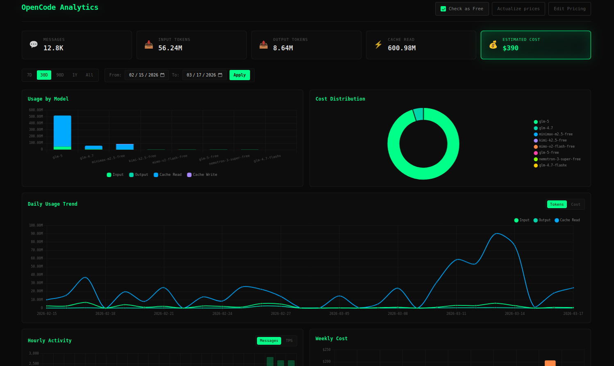
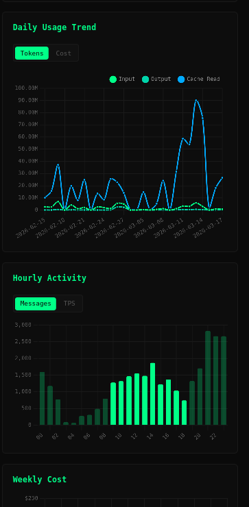

# OpenCode Analytics

[](https://www.npmjs.com/package/@lemantorus/opencode-analytics)
[](https://www.npmjs.com/package/@lemantorus/opencode-analytics)

> ⚠️ **Unofficial** - This is a community-built dashboard, not affiliated with or endorsed by [Anomaly](https://anoma.ly) (the creators of OpenCode).

A beautiful, real-time analytics dashboard for OpenCode that visualizes your AI coding usage, token consumption, costs, and model performance.



<details>
<summary>📱 Mobile View</summary>



</details>

## Features

### 📊 Usage Overview
- Total messages count
- Input/Output token breakdown
- Cache read/write statistics
- Estimated cost calculation

### 📈 Daily Usage Trend
- Interactive line chart showing token usage over time
- Toggle between Tokens view and Cost view
- Supports custom date ranges

### 🤖 Model Breakdown
- Comprehensive table of all models used
- Per-model statistics: messages, input/output tokens, cache, cost
- Visual bar chart comparison
- Cost distribution doughnut chart

### ⚡ Models Usage (TPS)
- Real tokens-per-second calculation using actual response times
- Select which models to compare (multi-select dropdown)
- Shows average TPS per day over the last 30 days
- Tooltip shows tree format with TPS + input/output tokens:
  ```
  Model Name
    ├─ TPS: 45.23 tok/s
    └─ In: 12.5K | Out: 8.2K
  ```

**How TPS is calculated:**
```
Output TPS = outputTokens / ((time.completed - time.created) / 1000)
```
This uses the actual response start and completion timestamps from each message, providing true generation speed metrics.

### 🕐 Hourly Activity
- See your most productive hours
- Toggle between Messages count and TPS view
- Visual indication of peak hours (business hours highlighted)

### 💰 Cost Management
- Automatic pricing from models.dev API
- Manual price overrides per model
- Total estimated cost tracking

### 🎨 Design
- Dark theme optimized for developers
- JetBrains Mono font
- Smooth animations
- Responsive layout

## Installation

### From npm (recommended)

```bash
npm install -g @lemantorus/opencode-analytics
```

### From source

```bash
git clone https://github.com/lemantorus/opencode_analytics.git
cd opencode_analytics
npm install
```

## Usage

### Quick Start

Simply run from anywhere:

```bash
opencode-analytics
```

This will:
1. Auto-detect your OpenCode database location based on your OS
2. Start the server on http://localhost:3456
3. Open the dashboard in your default browser

### Command Line Options

| Option | Alias | Description | Default |
|--------|-------|-------------|---------|
| `--port` | `-p` | Port to run server on | 3456 |
| `--db` | - | Path to OpenCode database | Auto-detected |
| `--no-open` | - | Don't open browser automatically | false |
| `--help` | `-h` | Show help message | - |

### Examples

```bash
# Run on custom port
opencode-analytics --port 4000

# Use custom database path
opencode-analytics --db /path/to/opencode.db

# Don't open browser
opencode-analytics --no-open

# Combine options
opencode-analytics -p 3000 --db ~/custom/opencode.db --no-open
```

### Environment Variables

```bash
# Override database path
OPENCODE_DB_PATH=/custom/path/opencode.db opencode-analytics

# Override port
PORT=4000 opencode-analytics
```

## Database Locations

OpenCode stores its SQLite database in platform-specific locations:

| OS | Path |
|----|------|
| Linux | `~/.local/share/opencode/opencode.db` |
| macOS | `~/.local/share/opencode/opencode.db` |
| Windows | `%USERPROFILE%\.local\share\opencode\opencode.db` |

The application automatically detects your OS and finds the database. You can override this with the `--db` flag or `OPENCODE_DB_PATH` environment variable.

## Custom Pricing

The dashboard fetches live pricing from [models.dev](https://models.dev), but you can override prices for any model:

1. Click "Edit Pricing" button
2. Modify prices per 1M tokens
3. Click "Save" for each model

Your custom prices are stored locally and will persist across sessions.

## Development

### Running from source

```bash
# Clone the repository
git clone https://github.com/lemantorus/opencode_analytics.git
cd opencode_analytics

# Install dependencies
npm install

# Start the server
npm start
```

### Project Structure

```
opencode-analytics/
├── bin/
│   └── opencode-analytics.js    # CLI entry point
├── server/
│   ├── index.js                # Express server
│   ├── db.js                   # Database queries
│   ├── pricing.json            # Cached pricing data
│   └── user-prices.json        # User overrides
├── public/
│   ├── index.html              # Dashboard HTML
│   ├── app.js                  # Frontend JavaScript
│   └── styles.css              # Dashboard styles
├── package.json
└── README.md
```

## Tech Stack

- **Backend**: Node.js, Express
- **Database**: SQLite (OpenCode's native DB)
- **Frontend**: Vanilla JavaScript, Chart.js
- **Build**: No build step required

## License

MIT License - feel free to use, modify, and distribute.

## Author

Built by [Lemantorus](https://github.com/lemantorus) - Not affiliated with [Anomaly](https://anoma.ly) or the official OpenCode project.

## Credits

- [OpenCode](https://opencode.ai) - The amazing AI coding agent
- [models.dev](https://models.dev) - For real-time model pricing
- [Chart.js](https://www.chartjs.org) - Beautiful charts

## Support

If you encounter any issues or have suggestions:

1. Check the [issues](https://github.com/lemantorus/opencode_analytics/issues)
2. Open a new issue if needed
3. Contributions are welcome!
